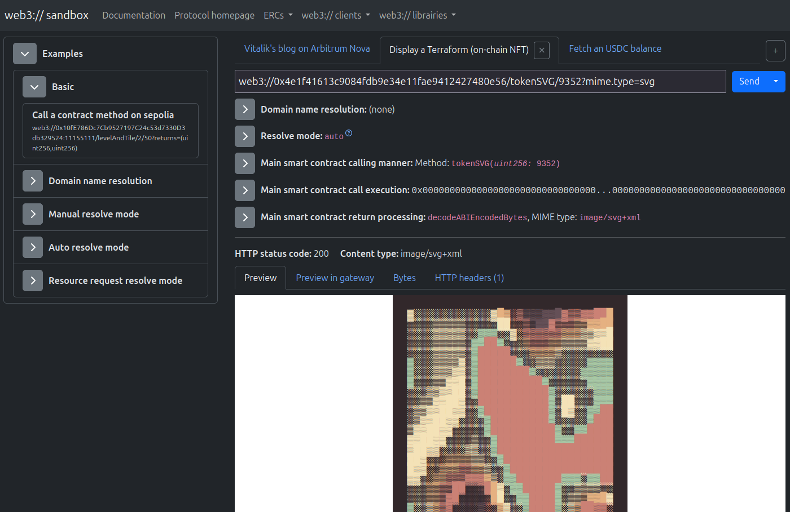

# Web3:// sandbox

``Web3:// sandbox`` is a educational ``web3://`` website made for developers, located at ``web3://w3-sandbox.eth`` and also accessible [via the w3link.io HTTP gateway](https://w3-sandbox.eth.eth.w3link.io/).

In this website, you can execute ``web3://`` requests and see how they work in details. It can be very helpful to debug ``web3://`` calls.

Additionally, you can make your own ``web3://`` calls and store them in the library.

