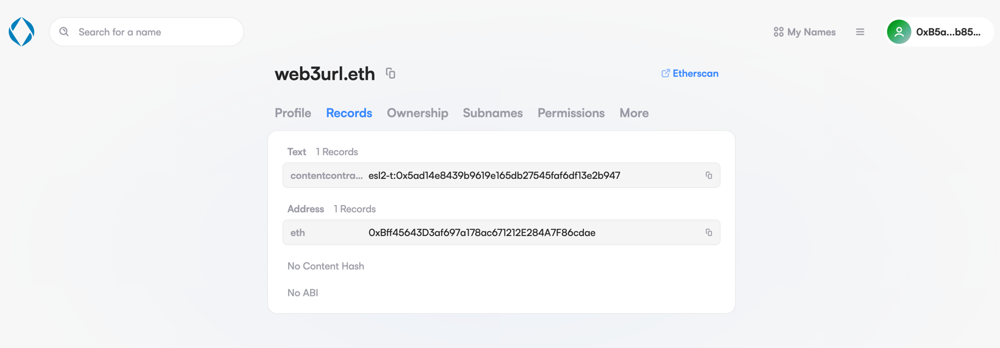

# Bind Domain Names to Your FlatDirectory

In the previous section, your website has been uploaded to a FlatDirectory contract and users can visit it through a web3 URL that contains the FlatDirectory contract address. What if we want to use a more user-friendly domain name instead of a contract address in the URL? Sure, we now support domain services: ENS, and you can bind any EVM-compatible contract address to the name!

## ENS Support

ENS is the most widely used name service in crypto, but interacting with a smart contract on ETH is super expensive (especially uploading a large amount of data), so it will be great to bind an ENS name to an [EIP-3770](https://eips.ethereum.org/EIPS/eip-3770) Address (a chain-specific address standard), and users can upload data on a cheaper chain/layer2 and still be able to use their ENS name to point to that.

As ENS users, you can add a new text record named “contentcontract” (the value is an EIP-3770 address) in the ENS setting panel, and the Web3URL gateway will handle the rest of it.

<figure><figcaption></figcaption></figure>

Check out [https://web3url.w3eth.io](https://web3url.w3eth.io) and its [ENS setting page.](https://app.ens.domains/name/web3url.eth/details)&#x20;

