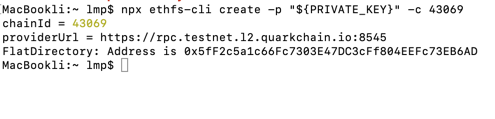
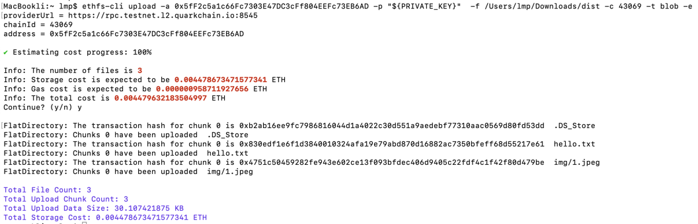

# Upload Your First File/Folder with ethfs-cli

## **Introduction**

In this tutorial, we will demonstrate how to upload files or folders using the **ethfs-cli** tool. We assume that

* there is a folder to be uploaded; (dist)
* there are two files in the folder. (hello.txt and img/1.jpeg)

<figure><figcaption></figcaption></figure>

## Step 1: Install ethfs-cli

You can install ethfs-cli by the following command

`npm i -g ethfs-cli`

The npm page of ethfs-cli can be found [here](https://www.npmjs.com/package/ethfs-cli).

## Step 2: Create the FlatDirectory Contract

We want to create a [FlatDirectory](https://docs.web3url.io/advanced-topics/flatdirectory) with the private key 0x112233... on the QuarkChain L2 Testnet

```
ethfs-cli create -p 0x112233... -c 43069
```

If we want to create it on the other chains that support EVM, we need to change the chainId, such as the Sepolia.

```
ethfs-cli create -p 0x112233... -c 11155111
```

The RPC URL of the chain can also be specified.

```
ethfs-cli create -p 0x112233... -r https://...
```

You will get a FlatDirectory address: [<mark style="color:blue;">0x5fF2c5a1c66Fc7303E47DC3cFf804EEFc73EB6AD</mark>](https://explorer.testnet.l2.quarkchain.io/address/0x5fF2c5a1c66Fc7303E47DC3cFf804EEFc73EB6AD/transactions) after the transaction is confirmed.

<figure><figcaption></figcaption></figure>

## Step 3: Upload Files

In this section, you will upload the folder into the FlatDirectory that you just created.

Run the command to upload the file.

```
ethfs-cli upload -a <address> -p <private-key> -f <directory|file> -c [chain-id] -t <upload-type> -e
```

The command to upload the contents of the "_dist"_ folder to the address "_0x5fF2...B6AD"_ is:

```
ethfs-cli upload -a 0x5fF2... -p 0x112233... -f /Users/.../dist -c 43069 -t blob -e
```

The execution results are as follows.

<figure><figcaption></figcaption></figure>

## Step 4: Set Default File

You can also set the default file for FlatDirectory using the _default_ command.

Run the command to set the default file.

```
ethfs-cli default -a <address> -f <name> -p <private-key> -c <chain-id>
```

The command to set the default file "_hello.txt"_ for "_0x5fF2...B6AD_" is:

```
ethfs-cli default -a 0x5fF2 -f hello.txt -p 0x1122.. -c 43069
```

## Step 5: Browse Your File!

Now, you should be able to browse the files that are just uploaded via

`https://${address}.3336.w3link.io/${filename}`

Our two file access addresses are:

[https://0x5fF2c5a1c66Fc7303E47DC3cFf804EEFc73EB6AD.3336.w3link.io/hello.txt](https://0x5fF2c5a1c66Fc7303E47DC3cFf804EEFc73EB6AD.3336.w3link.io/hello.txt)

[https://0x5fF2c5a1c66Fc7303E47DC3cFf804EEFc73EB6AD.3336.w3link.io/img/1.jpeg](https://0x5fF2c5a1c66Fc7303E47DC3cFf804EEFc73EB6AD.3336.w3link.io/img/1.jpeg)

Because the default file has been set to "_hello.txt"_ above, you can access it through the following link.

[https://0x5fF2c5a1c66Fc7303E47DC3cFf804EEFc73EB6AD.3336.w3link.io/](https://0x5fF2c5a1c66Fc7303E47DC3cFf804EEFc73EB6AD.3336.w3link.io/)

